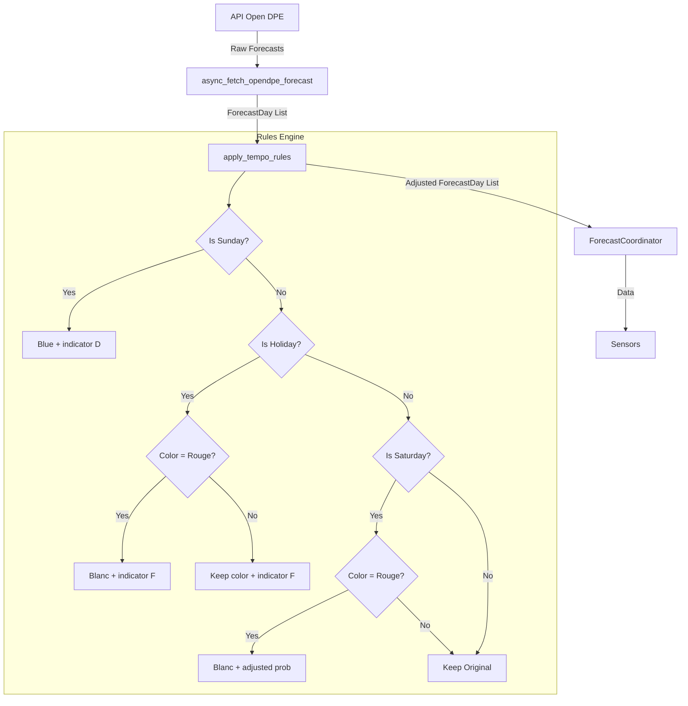

# Design Document: Tempo Forecast Rules

## Overview

Ce design décrit l'implémentation des règles Tempo EDF pour ajuster les prévisions de couleur sur 7 jours. Selon les règles officielles : **"Les jours rouges n'ont jamais lieu les week-ends ni les jours fériés."**

Le système applique des règles spécifiques pour les dimanches, jours fériés français et samedis avant de retourner les prévisions aux utilisateurs.

## Architecture



## Ordre de priorité des règles

1. **Dimanche** → Toujours bleu + indicateur "D" (priorité maximale)
2. **Jour férié** → Si rouge → blanc + "F", sinon garde couleur + "F"
3. **Samedi** → Si rouge → blanc avec probabilité ajustée
4. **Autres jours** → Garde la prévision originale

## Components and Interfaces

### Module `tempo_rules.py`

```python
def is_french_holiday(date: datetime.date) -> bool:
    """Vérifie si une date est un jour férié français."""

def compute_easter(year: int) -> datetime.date:
    """Calcule la date de Pâques (algorithme de Butcher-Meeus)."""

def get_movable_holidays(year: int) -> List[datetime.date]:
    """Retourne les fêtes mobiles pour une année."""

def adjust_forecast_day(forecast: ForecastDay) -> ForecastDay:
    """Ajuste une prévision individuelle selon les règles Tempo."""

def apply_tempo_rules(forecasts: List[ForecastDay]) -> List[ForecastDay]:
    """Applique les règles Tempo à une liste de prévisions."""
```

### Intégration dans `forecast_coordinator.py`

```python
async def _async_update_data(self) -> List[ForecastDay]:
    forecasts = await async_fetch_opendpe_forecast(self.session)
    return apply_tempo_rules(forecasts)
```

## Data Models

### ForecastDay

```python
@dataclass
class ForecastDay:
    date: datetime.date
    color: str                     # "bleu", "blanc", "rouge"
    probability: Optional[float]   # 0.0 à 1.0, ou None si indicator est défini
    indicator: Optional[str]       # "D" (dimanche), "F" (férié), ou None
    source: str = "open_dpe"
```

Le champ `indicator` :
- `"D"` pour dimanche (remplace probability, priorité maximale)
- `"F"` pour jour férié non-dimanche (remplace probability)
- `None` pour les autres jours (probability est utilisé)

## Jours fériés français

### Jours fériés fixes

| Date | Nom |
|------|-----|
| 1er janvier | Jour de l'An |
| 1er mai | Fête du Travail |
| 8 mai | Victoire 1945 |
| 14 juillet | Fête Nationale |
| 15 août | Assomption |
| 1er novembre | Toussaint |
| 11 novembre | Armistice |
| 25 décembre | Noël |

### Jours fériés mobiles (basés sur Pâques)

| Fête | Calcul |
|------|--------|
| Lundi de Pâques | Pâques + 1 jour |
| Ascension | Pâques + 39 jours |
| Lundi de Pentecôte | Pâques + 50 jours |

### Algorithme de Butcher-Meeus pour Pâques

```python
def compute_easter(year: int) -> datetime.date:
    a = year % 19
    b = year // 100
    c = year % 100
    d = b // 4
    e = b % 4
    f = (b + 8) // 25
    g = (b - f + 1) // 3
    h = (19 * a + b - d - g + 15) % 30
    i = c // 4
    k = c % 4
    l = (32 + 2 * e + 2 * i - h - k) % 7
    m = (a + 11 * h + 22 * l) // 451
    month = (h + l - 7 * m + 114) // 31
    day = ((h + l - 7 * m + 114) % 31) + 1
    return datetime.date(year, month, day)
```

### Exemple de dates pour 2025

| Fête | Date 2025 |
|------|-----------|
| Pâques | 20 avril |
| Lundi de Pâques | 21 avril |
| Ascension | 29 mai |
| Lundi de Pentecôte | 9 juin |

## Règles de conversion Rouge → Blanc

### Pour Samedi ET Jour Férié (même logique)

| Probabilité originale rouge | Nouvelle couleur | Nouvelle probabilité |
|----------------------------|------------------|---------------------|
| > 60% | blanc | 100% |
| ≤ 60% | blanc | originale + 10% |

La seule différence : les jours fériés ont l'indicateur "F" ajouté.

## Error Handling

| Scenario | Handling |
|----------|----------|
| Forecast with invalid color | Keep original, log warning |
| Forecast with None probability | Treat as 0.0 for calculations |
| Empty forecast list | Return empty list |
| Date calculation error for holidays | Log error, treat as non-holiday |
