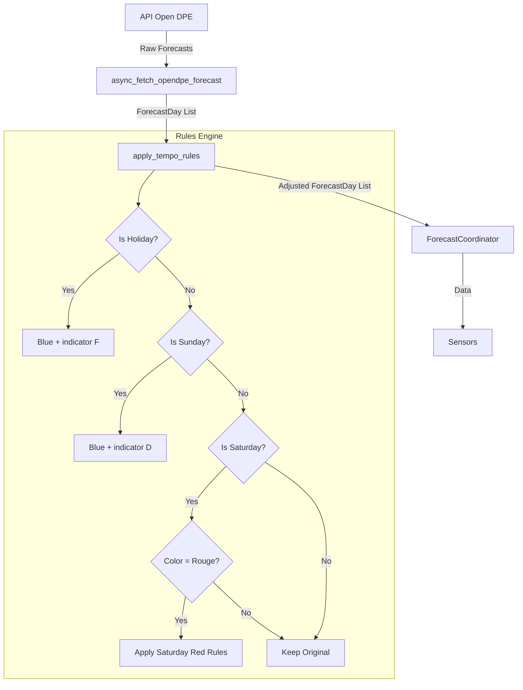

# Design Document: Tempo Forecast Rules

## Overview

Ce design décrit l'implémentation des règles Tempo pour ajuster les prévisions de couleur sur 7 jours. Le système doit appliquer des règles spécifiques pour les dimanches, jours fériés français et samedis avant de retourner les prévisions aux utilisateurs.

Les dimanches et jours fériés affichent un indicateur spécial ("D" ou "F") à la place de la probabilité.

## Architecture



## Components and Interfaces

### 1. Module `tempo_rules.py` (nouveau)

Ce nouveau module contiendra toute la logique des règles Tempo.

```python
def is_french_holiday(date: datetime.date) -> bool:
    """Vérifie si une date est un jour férié français."""
    pass

def apply_tempo_rules(forecasts: List[ForecastDay]) -> List[ForecastDay]:
    """Applique les règles Tempo à une liste de prévisions."""
    pass

def adjust_forecast_day(forecast: ForecastDay) -> ForecastDay:
    """Ajuste une prévision individuelle selon les règles Tempo."""
    pass
```

### 2. Modification de `forecast_coordinator.py`

Le coordinator appellera `apply_tempo_rules` après avoir récupéré les données de l'API.

```python
async def _async_update_data(self) -> List[ForecastDay]:
    forecasts = await async_fetch_opendpe_forecast(self.session)
    return apply_tempo_rules(forecasts)  # Nouvelle ligne
```

## Data Models

### ForecastDay (modifié)

```python
@dataclass
class ForecastDay:
    date: datetime.date
    color: str                     # "bleu", "blanc", "rouge"
    probability: Optional[float]   # 0.0 à 1.0, ou None si indicator est défini
    indicator: Optional[str]       # "D" (dimanche), "F" (férié), ou None
    source: str = "open_dpe"
```

Le champ `indicator` est nouveau :
- `"D"` pour dimanche (remplace probability)
- `"F"` pour jour férié (remplace probability, priorité sur D)
- `None` pour les autres jours (probability est utilisé)

### Constantes pour les jours fériés

```python
# Jours fériés fixes (mois, jour)
FIXED_HOLIDAYS = [
    (1, 1),    # Jour de l'An
    (5, 1),    # Fête du Travail
    (5, 8),    # Victoire 1945
    (7, 14),   # Fête Nationale
    (8, 15),   # Assomption
    (11, 1),   # Toussaint
    (11, 11),  # Armistice
    (12, 25),  # Noël
]
```

### Algorithme des fêtes mobiles

Les fêtes mobiles françaises dépendent de la date de Pâques :
- **Lundi de Pâques** : Pâques + 1 jour
- **Ascension** : Pâques + 39 jours (jeudi)
- **Lundi de Pentecôte** : Pâques + 50 jours

#### Calcul de la date de Pâques (Algorithme de Butcher-Meeus)

```python
def compute_easter(year: int) -> datetime.date:
    """
    Calcule la date de Pâques pour une année donnée.
    Utilise l'algorithme de Butcher-Meeus (valide pour les années 1583-4099).
    """
    a = year % 19
    b = year // 100
    c = year % 100
    d = b // 4
    e = b % 4
    f = (b + 8) // 25
    g = (b - f + 1) // 3
    h = (19 * a + b - d - g + 15) % 30
    i = c // 4
    k = c % 4
    l = (32 + 2 * e + 2 * i - h - k) % 7
    m = (a + 11 * h + 22 * l) // 451
    month = (h + l - 7 * m + 114) // 31
    day = ((h + l - 7 * m + 114) % 31) + 1
    return datetime.date(year, month, day)


def get_movable_holidays(year: int) -> list[datetime.date]:
    """
    Retourne les fêtes mobiles françaises pour une année donnée.
    """
    easter = compute_easter(year)
    return [
        easter + datetime.timedelta(days=1),   # Lundi de Pâques
        easter + datetime.timedelta(days=39),  # Ascension
        easter + datetime.timedelta(days=50),  # Lundi de Pentecôte
    ]
```

#### Fonction complète de détection des jours fériés

```python
def is_french_holiday(date: datetime.date) -> bool:
    """
    Vérifie si une date est un jour férié français.
    Inclut les jours fériés fixes et mobiles.
    """
    # Vérifier les jours fériés fixes
    if (date.month, date.day) in FIXED_HOLIDAYS:
        return True
    
    # Vérifier les jours fériés mobiles
    movable = get_movable_holidays(date.year)
    return date in movable
```

#### Exemple de dates pour 2025

| Fête | Date 2025 |
|------|-----------|
| Pâques | 20 avril |
| Lundi de Pâques | 21 avril |
| Ascension | 29 mai |
| Lundi de Pentecôte | 9 juin |

## Correctness Properties

*A property is a characteristic or behavior that should hold true across all valid executions of a system-essentially, a formal statement about what the system should do. Properties serve as the bridge between human-readable specifications and machine-verifiable correctness guarantees.*

### Property 1: Holiday Always Blue with F Indicator

*For any* forecast where the date is a French holiday, the adjusted forecast SHALL have color "bleu" and indicator "F", regardless of the original color, probability, and whether it's also a Sunday.

**Validates: Requirements 2.1, 2.2, 2.3, 2.5**

### Property 2: Sunday Always Blue with D Indicator (Non-Holiday)

*For any* forecast where the date is a Sunday and NOT a French holiday, the adjusted forecast SHALL have color "bleu" and indicator "D", regardless of the original color and probability.

**Validates: Requirements 1.1, 1.2, 1.3**

### Property 3: Saturday Red Conversion

*For any* forecast where the date is a Saturday and the original color is "rouge":
- If original probability > 0.6, the adjusted forecast SHALL have color "blanc" and probability 1.0
- If original probability ≤ 0.6, the adjusted forecast SHALL have color "blanc" and probability = original + 0.1

**Validates: Requirements 3.1, 3.2, 3.3**

### Property 4: Saturday Allowed Colors Unchanged

*For any* forecast where the date is a Saturday and the original color is "bleu" or "blanc", the adjusted forecast SHALL be identical to the original forecast (same color and probability).

**Validates: Requirements 4.1, 4.2**

### Property 5: Weekday Non-Holiday Unchanged

*For any* forecast where the date is a weekday (Monday-Friday) and NOT a French holiday, the adjusted forecast SHALL be identical to the original forecast (same color and probability).

**Validates: Requirements 5.1, 5.2**

### Property 6: Rule Idempotence

*For any* forecast, applying the rules twice SHALL produce the same result as applying them once. This ensures the rules are deterministic and stable.

**Validates: Requirements 6.1, 6.2**

## Error Handling

| Scenario | Handling |
|----------|----------|
| Forecast with invalid color | Keep original, log warning |
| Forecast with None probability | Treat as 0.0 for calculations |
| Empty forecast list | Return empty list |
| Date calculation error for holidays | Log error, treat as non-holiday |

## Testing Strategy

### Unit Tests

- Test `is_french_holiday()` avec des dates connues (fixes et mobiles)
- Test des cas limites (31 décembre, 2 janvier, etc.)
- Test de la conversion samedi rouge vers blanc
- Test de la priorité F sur D (dimanche férié)

### Property-Based Tests

Utiliser `hypothesis` pour Python :

```python
from hypothesis import given, strategies as st

@given(st.dates())
def test_holiday_always_blue_with_f(date):
    """Property 1: Holiday Always Blue with F Indicator"""
    if is_french_holiday(date):
        forecast = ForecastDay(date=date, color="rouge", probability=0.8)
        result = adjust_forecast_day(forecast)
        assert result.color == "bleu"
        assert result.indicator == "F"

@given(st.dates())
def test_sunday_non_holiday_blue_with_d(date):
    """Property 2: Sunday Always Blue with D Indicator (Non-Holiday)"""
    if date.weekday() == 6 and not is_french_holiday(date):
        forecast = ForecastDay(date=date, color="rouge", probability=0.8)
        result = adjust_forecast_day(forecast)
        assert result.color == "bleu"
        assert result.indicator == "D"
```

Chaque property test doit :
- Exécuter minimum 100 itérations
- Être annoté avec le numéro de propriété correspondant
- Référencer les requirements validés

### Test Coverage

| Property | Test Type | Requirements |
|----------|-----------|--------------|
| 1 | Property-based | 2.1, 2.2, 2.3, 2.5 |
| 2 | Property-based | 1.1, 1.2, 1.3 |
| 3 | Property-based | 3.1, 3.2, 3.3 |
| 4 | Property-based | 4.1, 4.2 |
| 5 | Property-based | 5.1, 5.2 |
| 6 | Property-based | 6.1, 6.2 |
| Holiday detection | Unit tests | 2.4 |
